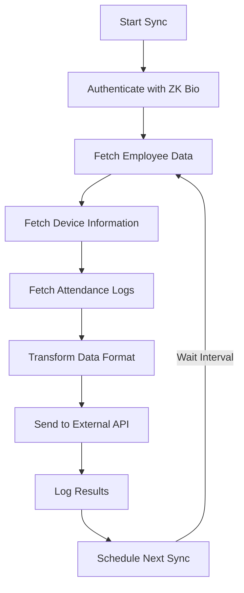

# HrmX Sync - ZK Bio Device Synchronization Application

**HrmX Sync** is a comprehensive biometric device synchronization application that seamlessly integrates ZK Bio attendance devices with external HR management systems. Built with Electron and Node.js, it provides both desktop and web-based interfaces for managing attendance data synchronization.

## 🎯 Problem Solved

The application addresses the critical challenge of **automated attendance data synchronization** between ZK Bio biometric devices and external HR systems. Organizations using ZK Bio devices for employee attendance tracking need a reliable, automated solution to:

- **Extract attendance data** from multiple ZK Bio devices
- **Transform and normalize** the data for external systems
- **Synchronize employee information** between devices and HR systems
- **Manage device configurations** including company IDs for multi-tenant environments
- **Monitor synchronization status** with comprehensive logging and error handling

## 🏗️ Architecture Overview

### Core Components

```
┌─────────────────┐    ┌─────────────────┐    ┌─────────────────┐
│   Frontend UI   │────│   Electron/Web  │────│   Backend API   │
│   (HTML/CSS/JS) │    │   Application   │    │   (Express.js)  │
└─────────────────┘    └─────────────────┘    └─────────────────┘
                                │                        │
                                │                        │
┌─────────────────┐    ┌─────────────────┐    ┌─────────────────┐
│   ZK Bio API   │────│  API Service    │────│  Database       │
│   (External)    │    │  Layer          │    │  (LowDB)        │
└─────────────────┘    └─────────────────┘    └─────────────────┘
                                │
                                │
                       ┌─────────────────┐
                       │  External HR    │
                       │  API Endpoint   │
                       └─────────────────┘
```

### Key Services

1. **API Service** (`src/services/apiService.js`)
   - Manages authentication with ZK Bio devices
   - Fetches employee data and attendance logs
   - Transforms data for external API consumption
   - Handles token renewal and error management

2. **Sync Service** (`src/services/syncService.js`)
   - Orchestrates periodic synchronization
   - Manages sync intervals and scheduling
   - Handles start/stop operations

3. **Database Service** (`src/services/dbService.js`)
   - Provides persistent storage using LowDB
   - Manages authentication credentials
   - Stores device configurations and company IDs
   - Maintains sync status and history

## 🚀 How It Works

### 1. Authentication & Setup
- Users configure ZK Bio server credentials through the settings interface
- Application authenticates using JWT tokens with automatic renewal
- Server URL and sync intervals are configurable

### 2. Data Synchronization Flow



### 3. Device Management
- Automatically discovers ZK Bio devices on the network
- Allows configuration of company IDs for multi-tenant setups
- Maintains device status and last activity tracking

### 4. Data Transformation
The application transforms raw ZK Bio data into a standardized format:

**Employee Data:**
```javascript
{
  user_id: "emp_code",
  username: "first_name last_name"
}
```

**Attendance Logs:**
```javascript
{
  timestamp: "2024-01-01T09:00:00Z",
  device_serial: "device_sn",
  user_id: "emp_code",
  company_id: "configured_company_id",
  created_at: "upload_time"
}
```

## 📋 Features

### Core Functionality
- ✅ **Automated Sync**: Configurable intervals (5, 10, 30 minutes)
- ✅ **Real-time Monitoring**: Live sync status and countdown timers
- ✅ **Device Management**: Configure company IDs for devices
- ✅ **Comprehensive Logging**: Detailed operation logs with export functionality
- ✅ **Error Handling**: Robust error management with user-friendly messages
- ✅ **Token Management**: Automatic JWT token renewal
- ✅ **Multi-Environment**: Supports both Electron and web deployment

### User Interface
- 🎨 **Modern Dark Theme**: Professional dark UI with red accent colors
- 📱 **Responsive Design**: Works on desktop and tablet screens
- 🔄 **Real-time Updates**: Live sync status and progress indicators
- 📊 **Status Dashboard**: Visual sync status with countdown timers
- ⚙️ **Settings Management**: Easy configuration interface
- 📋 **Device Table**: Tabular view of all detected devices

### Advanced Features
- 🔄 **Sync All Logs**: On-demand synchronization of all historical data
- 💾 **Persistent Storage**: Local database for configuration and state
- 🌐 **API Compatibility**: RESTful API endpoints for external integration
- 🖥️ **System Tray**: Minimizes to system tray for background operation
- 🔐 **Secure Storage**: Encrypted credential storage

## 🛠️ Installation & Setup

### Prerequisites
- Node.js (v16 or higher)
- npm or yarn package manager
- ZK Bio device with API access
- Network access to ZK Bio devices

### Installation Steps

1. **Clone the repository:**
   ```bash
   git clone <repository-url>
   cd zk-bio-sync
   ```

2. **Install dependencies:**
   ```bash
   npm install
   ```

3. **Development mode:**
   ```bash
   npm run dev
   ```

4. **Production Electron app:**
   ```bash
   npm start
   ```

5. **Web server mode:**
   ```bash
   npm run server
   ```

6. **Build executable:**
   ```bash
   npm run dist        # All platforms
   npm run winbuild    # Windows only
   ```

## 📖 Usage Guide

### Initial Setup

1. **Launch the application** using one of the start commands
2. **Navigate to Settings tab** to configure your environment
3. **Enter ZK Bio credentials:**
   - Username and password for ZK Bio device access
   - Server URL (e.g., `http://192.168.1.100:90`)
   - Sync period (5, 10, or 30 minutes)

### Device Configuration

1. **Go to Devices tab** to view discovered devices
2. **Set Company IDs** for each device (for multi-tenant setups)
3. **Click Save** to store device configurations

### Monitoring Operations

1. **Dashboard tab** shows real-time sync status
2. **Start/Stop sync** using the control button
3. **View logs** for detailed operation history
4. **Export logs** for external analysis

### Advanced Operations

- **Sync All Logs**: Use the "Sync All Device Logs" button in Settings for historical data sync
- **Manual Refresh**: Refresh device list manually when needed
- **Log Management**: Clear logs or export for troubleshooting

## 🔧 Configuration

### Environment Variables
Create a `.env` file for custom configuration:
```env
PORT=4000
ZK_BIO_SERVER_URL=http://192.168.1.100:90
EXTERNAL_API_URL=https://api-staging.easterncorporation.net/api/v1/attendances/import-device-data
```

### Database Schema
The application uses LowDB with the following structure:
```json
{
  "auth": {
    "username": "admin",
    "password": "password",
    "token": "jwt_token",
    "tokenGeneratedAt": "2024-01-01T00:00:00Z",
    "lastLogin": "2024-01-01T00:00:00Z"
  },
  "config": {
    "syncPeriod": "5",
    "serverUrl": "http://192.168.1.100:90",
    "lastSyncTime": "2024-01-01T00:00:00Z",
    "isRunning": false
  },
  "devices": [
    {
      "id": "device_id",
      "serialNumber": "device_sn",
      "name": "Device Name",
      "companyId": "company_123",
      "ipAddress": "192.168.1.101",
      "lastSeen": "2024-01-01T00:00:00Z"
    }
  ]
}
```

## 🔌 API Endpoints

### Sync Operations
- `POST /api/sync/start` - Start synchronization
- `POST /api/sync/stop` - Stop synchronization
- `GET /api/sync/status` - Get sync status
- `POST /api/sync-all-logs` - Sync all historical logs

### Settings Management
- `POST /api/settings/credentials` - Save authentication credentials
- `POST /api/settings/server` - Update server URL
- `GET /api/settings/config` - Get configuration settings

### Device Management
- `GET /api/devices` - Get all devices with company IDs
- `POST /api/devices/:deviceId/company` - Update device company ID

## 🏢 Deployment Options

### 1. Desktop Application (Recommended)
```bash
npm run dist
```
Creates platform-specific installers in the `dist/` directory.

### 2. Web Application
```bash
npm run server
```
Runs as a web server accessible via browser at `http://localhost:4000`.

### 3. Background Service
The Electron app can run minimized to system tray for background operation.

## 🐛 Troubleshooting

### Common Issues

1. **Connection Failed**
   - Verify ZK Bio device IP address and port
   - Check network connectivity
   - Ensure ZK Bio API is enabled

2. **Authentication Error**
   - Verify username and password
   - Check if account has API access permissions
   - Review token expiration settings

3. **Sync Not Starting**
   - Ensure all settings are configured
   - Check application logs for errors
   - Verify external API endpoint accessibility

### Debug Mode
Enable detailed logging by running:
```bash
DEBUG=* npm start
```

## 📦 Build Artifacts

The application builds produce:
- **Windows**: `.exe` installer and portable app
- **Linux**: `.AppImage` and `.deb` packages
- **macOS**: `.dmg` installer

Build configuration is in `package.json` under the `build` section.

## 🔒 Security Considerations

- Credentials are stored locally using Electron's secure storage
- JWT tokens are automatically renewed before expiration
- HTTPS is recommended for production deployments
- API keys and sensitive data are not logged

## 🤝 Contributing

1. Fork the repository
2. Create a feature branch
3. Make your changes
4. Add tests if applicable
5. Submit a pull request

## 📄 License

This project is licensed under the ISC License - see the LICENSE file for details.

## 🆘 Support

For technical support or questions:
- Check the application logs for detailed error information
- Review this documentation for configuration guidance
- Submit issues through the repository's issue tracker

---

**HrmX Sync** - Streamlining biometric attendance data integration for modern workplaces.
